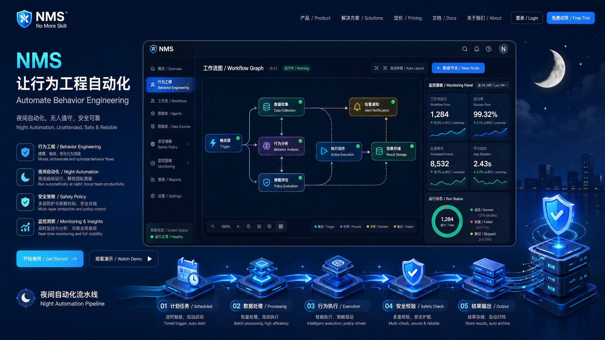

# no-more-skill (NMS)

默认语言：中文 | English: [README.en.md](./README.en.md)



NMS 不是“再写几个 Prompt”的工具，而是一个可持续进化的行为工程系统：
- 白天学习你的真实工作行为（skills/workflow/style）
- 夜间用受控状态机演练执行（PLAN -> EXECUTE -> TEST -> REVIEW -> GATE）
- 全程有安全护栏、可解释日志、可复盘指标

一句话：**把 Prompt 工程升级为 行为工程 + 执行系统。**

## 为什么它有特色

1. 它学的是“行为轨迹”，不是只记一段提示词。
2. 它默认安全：`dry-run`、重试上限、写入白名单、分支保护。
3. 它越来越懂你：会形成主 workflow、给出下一步行动建议。
4. 它可审计：night 模式支持 `--explain`，清楚告诉你为什么通过/回滚。

## 核心能力

- `nms ingest`: 注入压缩上下文，提取 skill/workflow 并更新用户画像
- `nms flow`: 专业行为驾驶舱（支持 `--format human|json`）
- `nms replay`: 复现最常用 workflow
- `nms night`: 受控夜间执行（默认 dry-run，`--explain` 可解释判定链）
- `nms doctor`: 只读健康诊断（数据完整性、schema、git 安全状态）
- `nms report`: 生成真实使用周报（可选出图）

## 安装方式（Install Matrix）

| 方式 | 适合场景 | 命令 |
|---|---|---|
| `npx skills` | 通用、最快 | `npx skills add zengyi-thinking/no-more-skill` |
| Claude 插件市场 | Claude Code 用户 | `/plugin marketplace add zengyi-thinking/no-more-skill` |
| 本地开发安装 | 调试/二次开发 | `npm install && npm run build && npm link` |
| 固定版本 Zip | CI/可复现安装 | `npm run release:pack` 生成 `dist/releases/*.zip`（包含 marketplace + skill） |

### Skill 调用格式（Slash Route）

如果你的宿主环境习惯 `/<skill>-<function>`，可以直接使用：

- `/nms-ingest --input input.json`
- `/nms-flow --format human`
- `/nms-flow --visual`
- `/nms-replay`
- `/nms-night --dry-run --explain --task-file task.json`
- `/nms-doctor`
- `/nms-report --image`

如果你的宿主环境偏好 GSD 风格 `/<skill>:<function>`，也同样支持：

- `/nms:ingest`
- `/nms:flow`
- `/nms:replay`
- `/nms:night`
- `/nms:doctor`

如果你的宿主环境是 Codex 风格 `$<skill>-<function>`，也支持：

- `$nms-flow`
- `$nms-night --dry-run --task-file task.json`
- `$nms-report --image`

> 注意：在本地 PowerShell 终端里测试 `$nms-*` 时，需要加引号，例：`npm run dev:skill -- '$nms-flow' --format human`。在 Claude/Codex 宿主输入框里不需要引号。

运行时命令对照：

| Runtime | 命令风格 |
|---|---|
| Claude/Cursor/OpenCode | `/nms-flow` |
| GSD/Gemini 风格 | `/nms:flow` |
| Codex 风格 | `$nms-flow` |

本地入口命令：

```bash
npm run dev:skill -- /nms-flow --format json
npm run dev -- route --cmd nms-flow --args-json "{\"format\":\"json\"}"
```

Claude 插件市场安装后可直接执行：

```bash
/plugin install nms-skills@no-more-skill
```

## 安装与快速开始

```bash
npm install
npm run build
```

准备一个输入文件 `input.json`：

```json
{
  "compressed_text": "PRD分析 UI生成 代码生成",
  "conversation": "先 PRD分析，再 UI生成，最后 代码生成",
  "tool": "codex"
}
```

运行完整链路：

```bash
npm run dev -- ingest --input input.json
npm run dev -- flow
npm run dev -- flow --format json
npm run dev -- flow --visual
npm run dev -- replay
npm run dev -- night --dry-run --explain --task-file task.json --time-budget 1
npm run dev -- doctor
npm run dev -- report
```

## 输出长什么样

`nms flow` 默认输出：
- 行为评分（Behavior Score）
- workflow 置信度
- 7日活跃度
- 陈旧风险
- 连续使用天数
- 可执行建议（`why + next command`）

`nms flow --visual`：
- 生成本地 HTML 图表面板：`.nms/flow-dashboard.html`

`nms report --image`：
- 生成 `docs/reports/latest/report.md`
- 调用你配置的中转站（默认模型 `gpt-image-2`）输出三张图：
  - `skill-frequency.png`
  - `work-progress.png`
  - `persona-evolution.png`

中转站环境变量：
```bash
NMS_IMAGE_BASE_URL="https://api.apimart.ai/v1/images/generations"
NMS_IMAGE_API_KEY="<token>"
NMS_IMAGE_MODEL="gpt-image-2"
```

`nms night --explain` 默认输出：
- 状态流转日志（含耗时与决策）
- Gate 判定链
- 失败分级（`CONFIG_ERROR / POLICY_BLOCK / TEST_FAIL / REVIEW_FAIL / TIMEOUT`）

`task.json` 示例（真实任务输入）：
```json
{
  "task": "实现某个真实需求的夜间执行计划",
  "files": ["sandbox/new/widget.tsx", "sandbox/new/widget.test.ts"],
  "constraints": ["仅允许 UI/new/test 范围内改动"],
  "test_plan": ["npm test"]
}
```

## 安全边界（默认开启）

- `--apply` 必须显式开启
- 不允许跳过 TEST/REVIEW
- `max_retry = 3`
- 写入仅允许白名单路径与受限文件类型（UI/new/test）
- main 分支提交保护

## 项目结构

- `src/hook/*`：行为提取与收敛
- `src/harness/*`：夜间状态机与 Gate
- `src/commands.ts`：CLI 命令实现
- `tests/nms.test.ts`：核心测试
- `SKILL.md`：Skill 规范入口

## 适合谁

- 想把 AI 使用从“偶尔好用”变成“稳定可复用”的个人开发者
- 需要把 AI 自动化接入工程流程的技术团队
- 想做可解释、可审计、可持续学习的 Agent 产品原型
